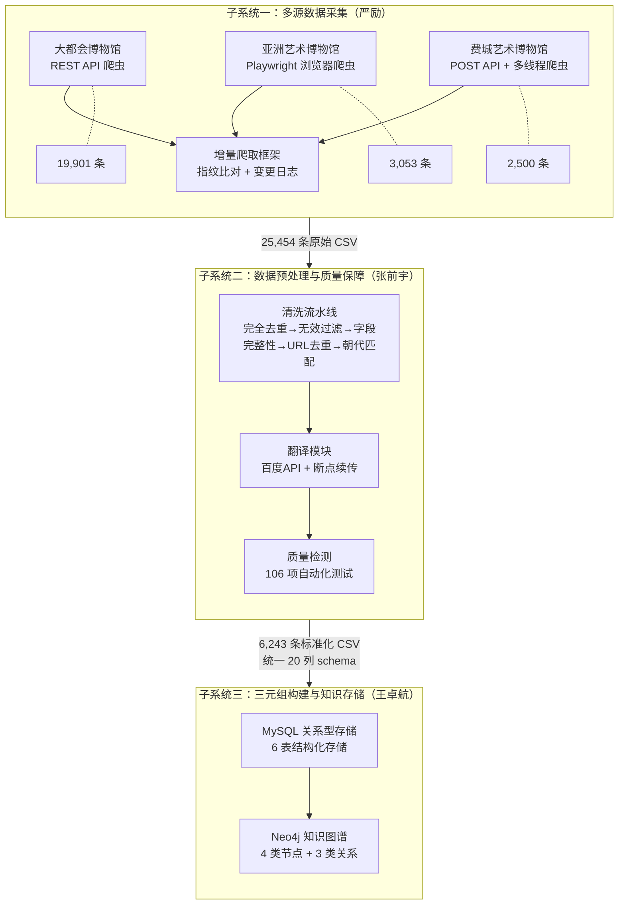
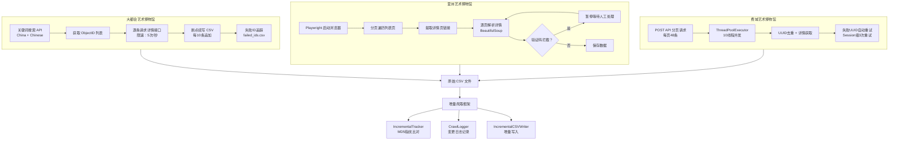
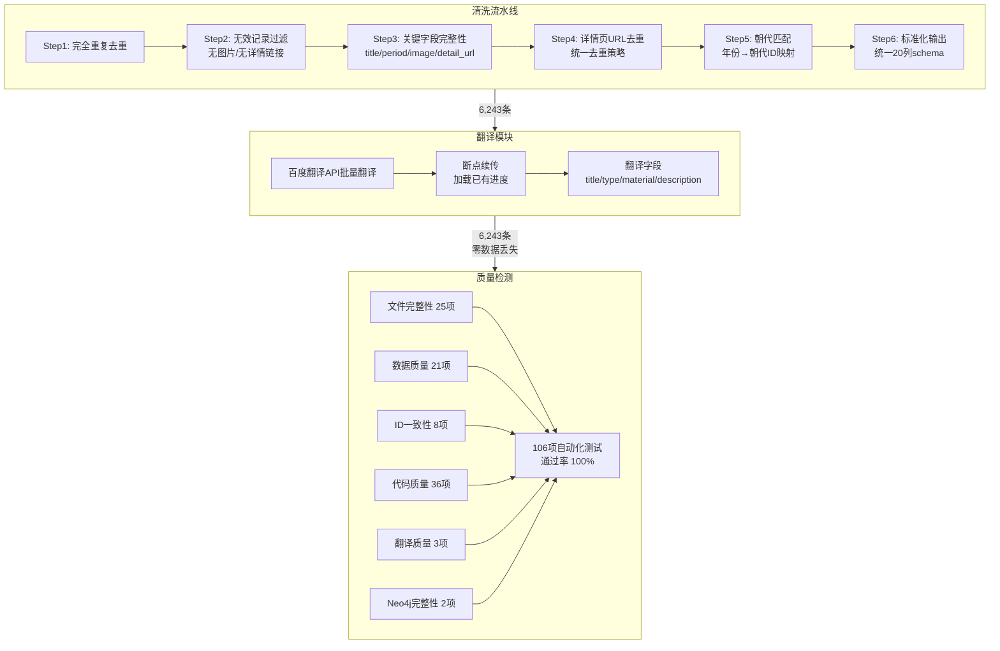
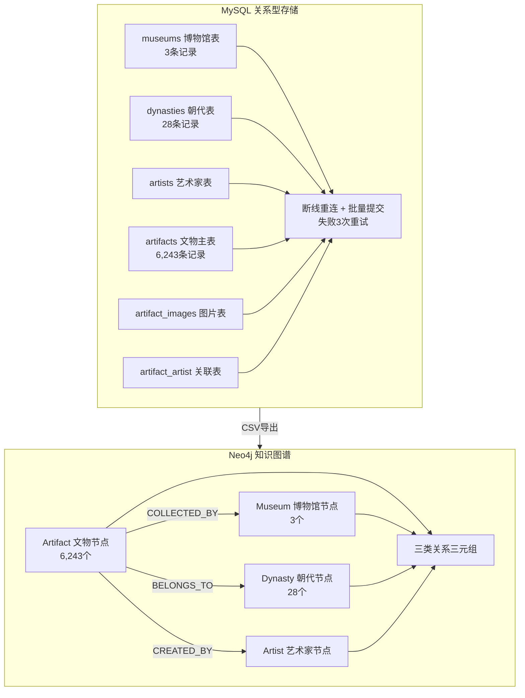
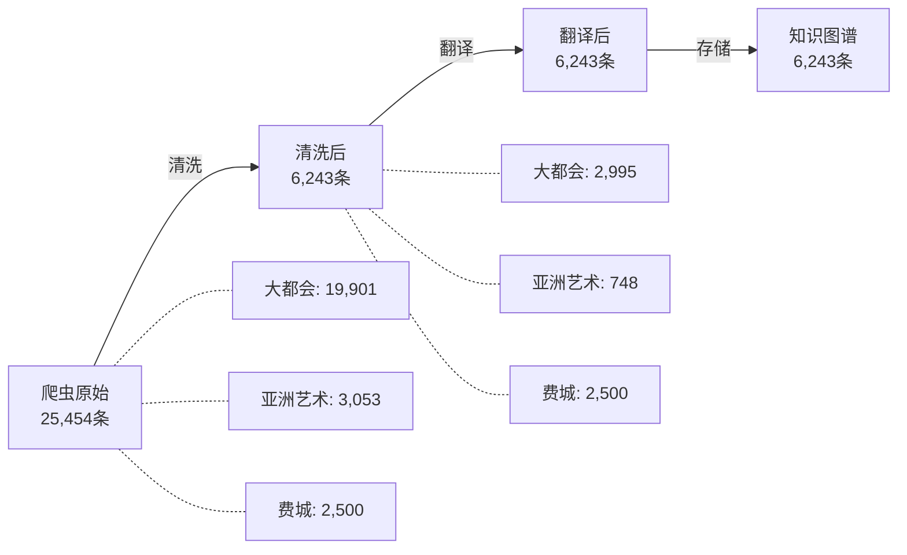

# 子系统集成流程图

---

## 一、系统总体集成架构

---

## 二、子系统一详细流程：多源数据采集

---

## 三、子系统二详细流程：数据预处理与质量保障

---

## 四、子系统三详细流程：三元组构建与知识存储

---

## 五、子系统集成接口与数据流

```mermaid
flowchart LR
    subgraph 接口1["集成接口1：原始CSV"]
        I1a["大都会: daduihui_en.csv<br/>8列, 19,901条"]
        I1b["亚洲艺术: objects_china_verified_dedup.csv<br/>11列, 3,053条"]
        I1c["费城: Philamuseum_..._final.csv<br/>12列, 2,500条"]
    end

    subgraph 接口2["集成接口2：标准化CSV"]
        I2a["daduhui_final.csv<br/>20列, 2,995条"]
        I2b["asian_final.csv / asian_final_translated.csv<br/>20列, 748条"]
        I2c["clean_artifacts.csv / clean_artifacts_translated.csv<br/>21列, 2,500条"]
    end

    subgraph 接口3["集成接口3：数据库CSV"]
        I3a["museums / dynasties / artists"]
        I3b["artifacts / artifact_images"]
        I3c["artifact_artist"]
    end

    接口1 -->|"采集→预处理"| 接口2
    接口2 -->|"预处理→存储"| 接口3
```

---

## 六、集成过程中遇到的问题与解决方案

| 序号 | 问题 | 涉及子系统 | 根因 | 解决方案 | 效果 |
|------|------|-----------|------|---------|------|
| 1 | 三馆 object_id 冲突 | 采集→预处理→存储 | 三馆独立编号，ID范围重叠 | 分段ID分配：费城1~2500，大都会2501~5495，亚洲艺术5527~6274 | 零冲突 |
| 2 | 清洗-翻译数据行数不一致 | 预处理内部 | 清洗和翻译独立运行，筛选条件不同 | 基于 detail_url 严格对齐，重新筛选清洗数据 | 2,995行完全对齐 |
| 3 | 大都会 type 字段100%为空 | 预处理→存储 | API未提供type字段 | 基于material智能推断引擎，覆盖9大文物类型 | 空值率100%→0.2% |
| 4 | 朝代匹配跨馆不一致 | 采集→预处理→存储 | 各脚本独立定义朝代映射 | 统一朝代表（clean_dynasties.csv），所有脚本引用同一映射 | 25条朝代完全一致 |
| 5 | 翻译中断需从头开始 | 预处理内部 | 无进度持久化 | 断点续传机制，加载已有翻译进度文件 | 中断后可继续 |
| 6 | 全量爬取效率低 | 采集→预处理 | 每次重新下载所有数据 | 增量爬取框架，MD5指纹比对仅处理变更 | 二次爬取仅处理新增/更新 |
| 7 | MySQL大批量写入断线 | 预处理→存储 | 网络不稳定导致连接中断 | 错误码检测+自动重连+每50条批量提交 | 写入成功率100% |
| 8 | 亚洲艺术含非中国文物 | 采集→预处理 | 爬虫按"China"关键词搜索，结果含日韩文物 | NON_CHINESE_PERIODS过滤器 + Department字段筛选 | 仅保留Chinese Art |
| 9 | 费城数据含HTML标签 | 预处理 | API返回的摘要字段含HTML | clean_html()函数，HTML转纯文本 | 标签全部清除 |

---

## 七、数据量流转统计

> **核心指标**：翻译和知识图谱阶段数据量与清洗后完全一致，**零数据丢失**。
